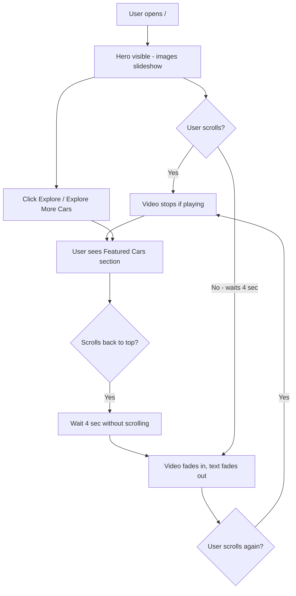

# Motor-Heads — Project Guide

This document is your **long-term reference** It explains how the app works, what each file does, tricky logic in plain language, and React concepts used here (good for interview revision).

---

## 1. What is this project?

**Motor-Heads** is a single-page-style marketing site built with React. There is **no backend yet**.

Main features:

- Full-screen **hero** with rotating background images
- **Auto-play video** after ~4 seconds if not scrolled (while hero is visible)
- **Smooth fade** between images and video
- **Explore More Cars** button + navbar **Explore** → smooth scroll to a placeholder cars section
- Routes for **About** and **Contact**
- Assets (images + video) kept in the repo; Vite optimizes them at build time

---

## 2. User flow (easy picture)



**In one sentence:** Stay on the hero without scrolling → video plays and text hides. Scroll anywhere → video stops. Scroll back to top and wait → video can start again.

---

## 3. How the page is laid out (scroll)

The home page is **one long document**, not a locked screen:

```
┌─────────────────────────────┐
│  Navbar (absolute, on top)   │
│  Hero (100vh)                │  ← ref={heroRef}, background inside here
│  - Background (absolute)     │
│  - Hero text + button + dots │
├─────────────────────────────┤
│  CarsSection (#explore-cars) │  ← scroll target
└─────────────────────────────┘
```

- **Scroll is always allowed** on the home page.
- Background uses `absolute` inside the hero (not `fixed`), so when you scroll down, the hero background **does not** stick on top of the cars section.

---

## 4. What each file does

### Entry & routing

| File | Role |
|------|------|
| `index.html` | HTML shell; loads `main.jsx` |
| `src/main.jsx` | Renders React app; wraps with `BrowserRouter` |
| `src/App.jsx` | Defines routes: `/`, `/about`, `/contact`; `/explore` redirects home with scroll state |
| `src/layouts/MainLayout.jsx` | Shared shell: `Navbar` + `<Outlet />` for child routes |

### Pages

| File | Role |
|------|------|
| `src/pages/HomePage.jsx` | Hero state, slideshow timer, auto-video hook, cars section below hero |
| `src/pages/AboutPage.jsx` | Static about content |
| `src/pages/ContactPage.jsx` | Static contact content |

### Components

| File | Role |
|------|------|
| `src/Components/Navbar/Navbar.jsx` | Logo + links; Explore scrolls to `#explore-cars` |
| `src/Components/Hero/Hero.jsx` | Headline, Explore button, carousel dots; hides text when video plays |
| `src/Components/Background/Background.jsx` | Image layer + video layer with **opacity crossfade** |
| `src/Components/CarsSection/CarsSection.jsx` | Placeholder cards until API exists |

### Logic & data

| File | Role |
|------|------|
| `src/constants/heroAssets.js` | Imports all 5 hero JPGs into one array |
| `src/hooks/useAutoPlayVideo.js` | Idle timer + scroll/visibility → start/stop video |
| `src/hooks/usePreloadImages.js` | Preloads **next** slide image in the background |
| `src/utils/scrollToCars.js` | `scrollIntoView` on `#explore-cars` |

### Styles & config

| File | Role |
|------|------|
| `src/index.css` | Tailwind + `fadeIn` animation for image changes |
| `tailwind.config.js` | Fonts (Outfit, Poppins) |
| `vite.config.js` | Build; large assets stay separate files (not inlined in JS) |
| `vercel.json` | SPA rewrite for production |
| `public/_redirects` | Same for Netlify |

### Assets (`src/assets/`)

- `image1.jpg` … `image5.jpg` — hero slideshow
- `video2.mp4` — background video (lazy-loaded in JS, preloaded on mount for smoother fade)

---

## 5. Difficult logic explained simply

### A. Smooth video start / stop (`Background.jsx`)

**Old behavior:** React swapped `` for `<video>` → abrupt jump.

**New behavior:** Both layers exist at the same time:

- Image: `opacity-100` when idle, `opacity-0` when video plays
- Video: opposite opacity
- CSS: `transition-opacity duration-700 ease-in-out`

So the change feels like a **crossfade**, not a hard cut.

Video is also **preloaded on mount** (import runs once), so when the 4s timer fires, the file is often already ready.

When video stops, we `pause()` and reset `currentTime = 0` so the next play starts cleanly.

---

### B. Auto-play video (`useAutoPlayVideo.js`)

Three signals control playback:

1. **Idle timer (4 seconds)**  
   When hero is “in view”, start a timer. When it fires → `isVideoPlaying = true`.

2. **Scroll**  
   Any scroll → `stopVideo()` immediately.  
   If user is back at top (`scrollY < 80`) and hero still visible → restart idle timer.

3. **IntersectionObserver**  
   Watches `heroRef`. If less than ~55% of hero is visible (user scrolled to cars) → stop video.

**Why `useRef` for the timer?**  
The timeout ID must persist across renders without causing re-renders. Refs hold mutable values that don’t trigger UI updates.

**Why `useCallback` for `stopVideo` / `startIdleTimer`?**  
Stable function references for `useEffect` dependencies, so effects don’t re-subscribe every render.

---

### C. Hide hero text when video plays (`Hero.jsx`)

`showText={!isVideoPlaying}` toggles:

```jsx
className={`... transition-opacity duration-500 ${
  showText ? 'opacity-100' : 'pointer-events-none opacity-0'
}`}
```

Text fades out; button + dots stay (bottom-left).

---

### D. Image slideshow pauses during video (`HomePage.jsx`)

```jsx
useEffect(() => {
  if (isVideoPlaying) return
  const interval = setInterval(() => { ... }, 3000)
  return () => clearInterval(interval)
}, [isVideoPlaying])
```

No point rotating images behind a playing video.

---

### E. Preload next image (`usePreloadImages.js`)

```js
const img = new Image()
img.src = images[nextIndex]
```

Browser fetches the next JPG in the background so clicking a dot or auto-advance feels instant.

---

### F. Lazy video bundle (`Background.jsx` + Vite)

```js
import('../../assets/video2.mp4')
```

Vite emits a separate chunk/file. The ~9MB video is **not** inside the main JS bundle. We preload on mount for UX; you could delay until first play to save initial bandwidth (tradeoff).

---

### G. Routing + scroll to cars

- **Navbar Explore** on home: `scrollToCars()` → `#explore-cars`
- **From another page**: `navigate('/', { state: { scrollTo: 'explore-cars' } })`  
  `HomePage` reads `location.state` and scrolls after mount.
- **`/explore` URL**: `Navigate` in `App.jsx` sends user to `/` with that same state.

---

### H. HTTPS without you adding a certificate

When you deploy to **Vercel** (or similar):

- Their servers sit in front of your app (CDN / edge).
- They request a **free SSL certificate** from **Let’s Encrypt** for your domain.
- Certificates **auto-renew** before expiry.
- Your browser sees `https://` because the **host** terminates TLS, not your React code.

You never touch PEM files or Certbot unless you self-host on a VPS.

---

## 6. React concepts used here (revision for interviews)

### Components & JSX

Everything in `Components/` and `pages/` is a function that returns JSX. Props pass data down (e.g. `heroData`, `playStatus`).

---

### `useState`

Local UI state that triggers re-render when it changes.

**In this project:**

- `heroCount` — which slide (0–4)
- `isVideoPlaying` — video on/off
- `videoSrc` — URL string after MP4 import resolves

```jsx
const [heroCount, setHeroCount] = useState(0)
```

---

### `useEffect`

Run side effects **after** render: timers, listeners, observers, fetching.

**Examples here:**

- Start/stop slideshow interval
- Attach `scroll` listener
- `IntersectionObserver` on hero
- Load video file
- Pause/play video element

**Cleanup** (return function) removes listeners/timers → prevents memory leaks.

```jsx
useEffect(() => {
  const interval = setInterval(...)
  return () => clearInterval(interval)
}, [isVideoPlaying])
```

The dependency array `[isVideoPlaying]` means: re-run when that value changes.

---

### `useRef`

A box `{ current: value }` that **persists** across renders and **does not** cause re-render when updated.

**Uses here:**

1. `heroRef` on the hero `<div>` — pass DOM node to `IntersectionObserver`
2. `videoRef` on `<video>` — call `.play()` / `.pause()`
3. `idleTimerRef` — store `setTimeout` id

```jsx
const heroRef = useRef(null)
// ...
<div ref={heroRef} className="relative h-screen">
```

---

### `useCallback`

Returns a **memoized** function (same reference until dependencies change).

**Why we use it:** Effects depend on `stopVideo` / `startIdleTimer`. Without `useCallback`, new function identity every render → effect re-runs too often.

```jsx
const stopVideo = useCallback(() => {
  clearIdleTimer()
  setIsVideoPlaying(false)
}, [clearIdleTimer])
```

---

### Custom hooks

`useAutoPlayVideo` and `usePreloadImages` extract logic so `HomePage` stays readable. Convention: name starts with `use`.

---

### React Router

| API | Purpose in this app |
|-----|---------------------|
| `BrowserRouter` | HTML5 history URLs (`/about`, not `#/about`) |
| `Routes` / `Route` | Map URL → component |
| `Outlet` | Where child route renders inside layout |
| `NavLink` | Link with active styling |
| `useNavigate` | Programmatic navigation (Explore from other pages) |
| `useLocation` | Read `state` for scroll-after-navigation |
| `Navigate` | Redirect `/explore` → `/` with state |

**SPA note:** Only one `index.html`. Server must rewrite unknown paths to it (`vercel.json` / `_redirects`).

---

### Props & lifting state

State lives in `HomePage`; children receive values + callbacks:

- `Background` gets `playStatus`, `heroCount`, `images`
- `Hero` gets `showText`, `onExploreClick`, `onSlideChange`

One-way data flow: parent → child; child notifies parent via callbacks.

---

### Conditional rendering

```jsx
{videoSrc && <video ... />}
{showText ? 'opacity-100' : 'opacity-0'}
```

---

### Dynamic import (code splitting)

```js
import('../../assets/video2.mp4')
```

Returns a Promise → separate asset in production build.

---

## 7. Commands cheat sheet

| Command | What it does |
|---------|----------------|
| `npm run dev` | Dev server + hot reload |
| `npm run build` | Output to `dist/` |
| `npm run preview` | Serve `dist/` locally |
| `npm run lint` | ESLint |

---

## 8. Future improvements (when you add backend)

- Replace `CarsSection` placeholders with API fetch (`useEffect` + `fetch` or React Query)
- Add loading/error states
- Optional: compress `image2`, `image4`, `image5`, and `video2.mp4` for faster first paint
- Environment variables for API URL (`.env` + `import.meta.env.VITE_*`)

---

## 9. Quick debugging tips

| Problem | Check |
|---------|--------|
| Video never plays | Wait 4s on hero without scrolling; open Network tab for `video2` |
| Video stuck on cars section | Background should be `absolute` inside hero, not `fixed` |
| Scroll doesn’t reach cars | Element `id="explore-cars"` exists; scroll not blocked |
| 404 on `/about` in production | `vercel.json` / `_redirects` deployed |
| Black screen | z-index: hero content `z-10`, background `z-0` |

---

*Last aligned with: scroll unlocked on home, smooth 700ms video crossfade, auto-play after 4s idle.*
